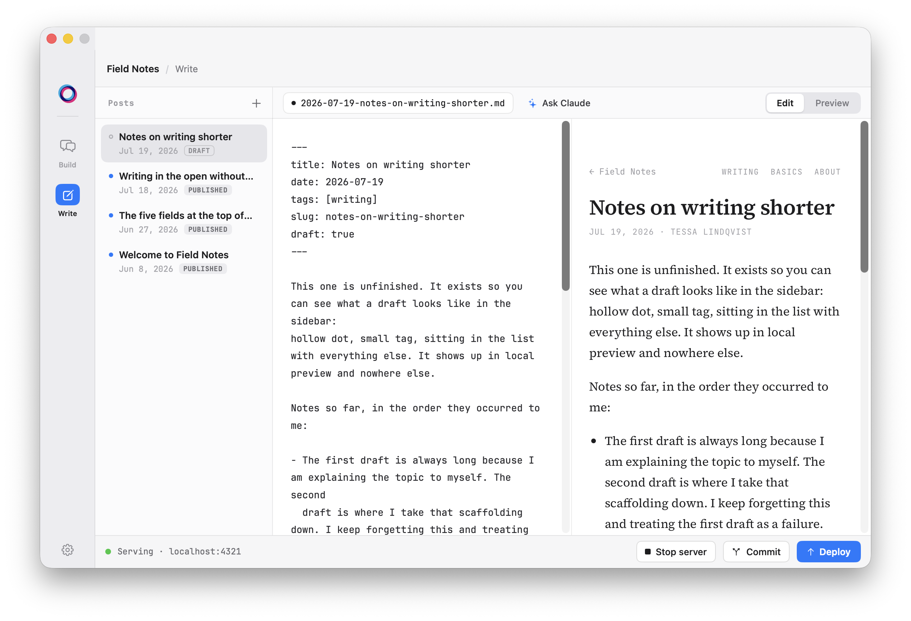
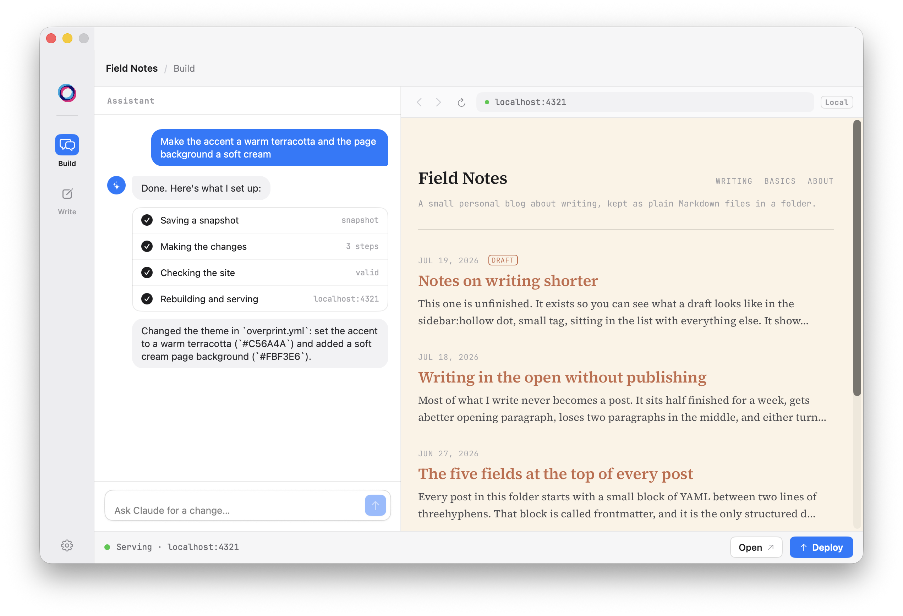
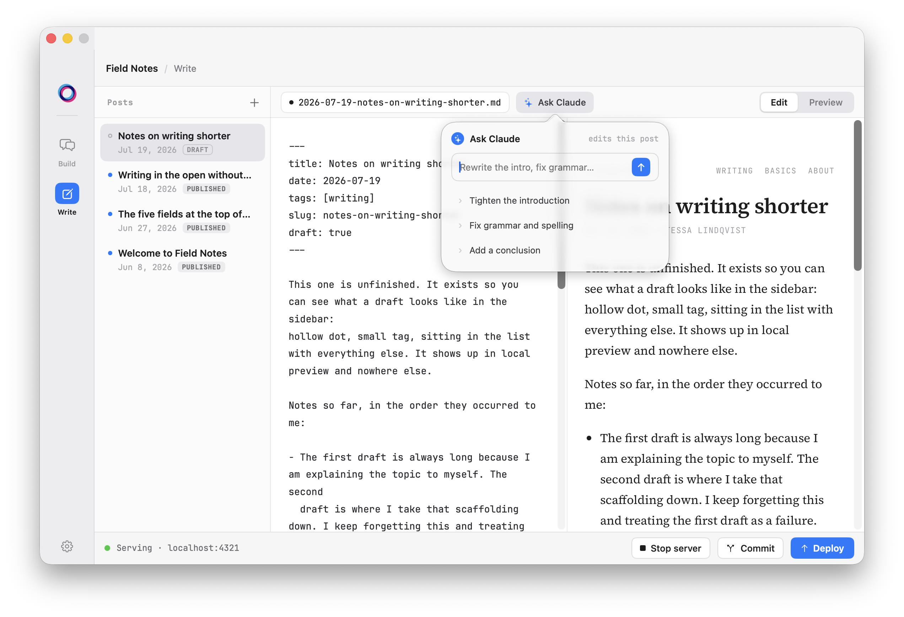
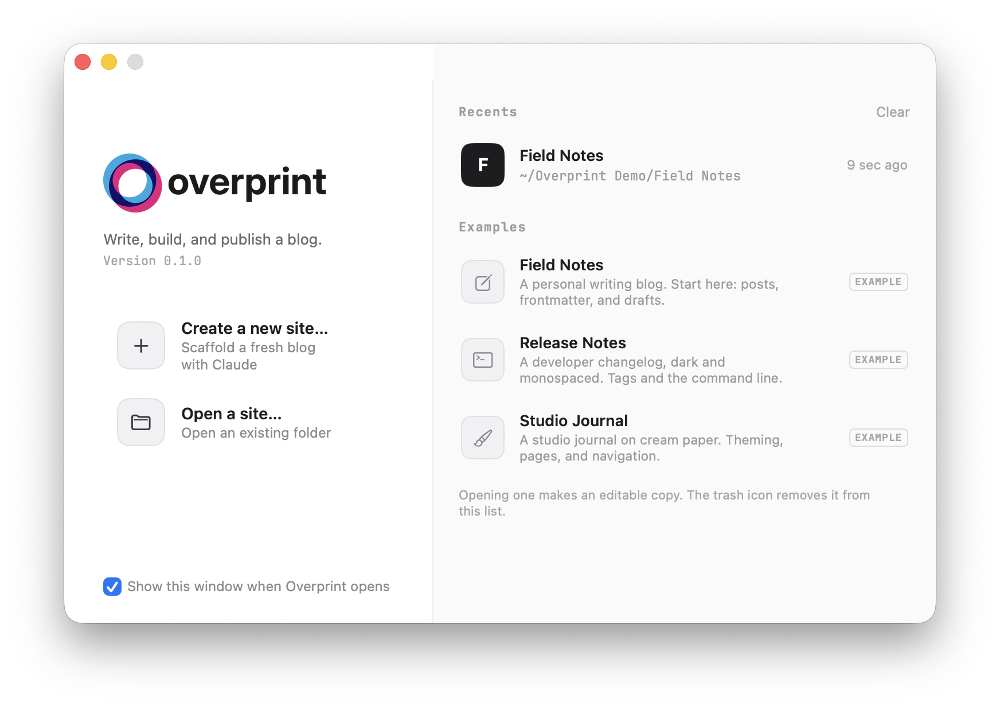

<p align="center">
  
</p>

<p align="center">
  <strong>A native macOS blogging app you can talk to.</strong><br>
  Write in Markdown, build your site by describing it, and publish it to a domain you own.
</p>

<p align="center">
  Your posts are plain files in a folder. Hosting is free forever on GitHub Pages,<br>
  with your own domain and HTTPS, and no server to run.
</p>

<p align="center">
  
</p>

---

## Describe your site, and it builds it

<p align="center">
  
</p>

Build mode is a chat that works directly in your site folder, editing the Markdown and the config the way you would:

> *"A minimal personal blog with a dark editorial theme"* scaffolds the whole site
> *"Make the accent a warm terracotta and the page background a soft cream"* re-themes it
> *"Add an about page"* or *"rewrite my last post"* does exactly that

Every turn commits to git before touching anything, so any change is one `git revert` away. The site is validated afterwards, and if it no longer builds, nothing is published.

## Write, with an editor that can edit

<p align="center">
  
</p>

A Markdown editor beside a live preview of the real, rendered page. Drafts sit in the list with your published posts and stay out of the feed until you say so.

**Ask Claude** works on the draft in front of you, without leaving the editor. One click for *tighten the introduction*, *fix grammar and spelling*, or *add a conclusion*, or type your own instruction. It rewrites the body in place and leaves your frontmatter alone.

### No API key, no extra bill

Both surfaces run through [Claude Code](https://claude.com/claude-code) on your own machine, on your existing Claude subscription. Nothing is metered and no key is stored. Without Claude Code installed, they disable themselves and the rest of the app works exactly the same.

Pick the model (Opus, Sonnet, or Haiku) in Settings. If Claude Code needs a token for headless use, run `claude setup-token` and paste the result into Settings; it goes to your Keychain.

---

## Publish for free, on your own domain

Overprint publishes to **GitHub Pages**. Connect a site to a repository once, and every publish after that is a single click.

- **No hosting bill, at any traffic level.** Static files served off GitHub's CDN.
- **Your own domain.** Point `blog.example.com` at it and Overprint writes the `CNAME` for you.
- **HTTPS included**, issued and renewed automatically.
- **Nothing to maintain.** No server and no runtime, so nothing to patch or keep up to date.
- **Your writing stays yours.** It is a folder of Markdown in your own git repository, and it still builds if Overprint goes away.

Commit saves your writing to `main`. Deploy builds the site with drafts excluded and publishes it to `gh-pages`. Two branches, two jobs: your source history accumulates, the generated site is replaced each time.

## How it works

Overprint builds your Markdown into a static site with its own Swift generator and previews it on localhost while you write.

The folder on disk is the whole thing. Everything lives in `overprint.yml` and the files under `content/`, so you can edit a site in Overprint, in a text editor, with a script, or with an agent, in any order, and nothing gets out of sync.

The engine (`OverprintKit`) is a library. The app, the `overprint` CLI, and anything else you point at a site folder are thin front-ends over the same operations.

**The name.** In printing, overprinting is laying one ink directly over another so the colors combine instead of one knocking the other out. The logo is two rings doing exactly that.

## Installing

Download the latest `Overprint.dmg` from [Releases](https://github.com/mcavus/overprint/releases), open it, and drag Overprint to Applications. The first launch shows the normal macOS prompt for an app downloaded from the internet. Builds are signed and notarized, so there is no "unidentified developer" warning and nothing to disable in System Settings.

Overprint updates itself, checking in the background and offering new versions. You can also check from **Overprint > Check for Updates**.

The `overprint` command line tool ships inside the app. Open **Settings > Command line tool** and click Install to link it onto your PATH.

## Using it

<p align="center">
  
</p>

1. **Create a new site**, or open an example from the launch window to learn by reading one.
2. **Write** in the Markdown editor with a live preview.
3. **Connect** the site to a GitHub repository once, the first time you Deploy.
4. **Commit** to save your writing, and **Deploy** to publish the built site to GitHub Pages.

## Site layout

```
my-site/
  overprint.yml            # site config
  AGENTS.md                # the contract, for agents and humans
  content/
    posts/
      2026-07-16-hello.md
    pages/                 # optional standalone pages
      about.md
  dist/                    # generated output, never edit by hand
```

`overprint.yml`:

```yaml
title: My Blog
author: Your Name
description: A short line about the site.
url: https://blog.example.com
theme:
  mode: light        # light | dark
  accent: "#0A7AFF"
  font: serif        # serif | sans | mono
  background: null   # optional page color, overrides the mode default
nav:                 # optional header navigation
  - { label: Writing, url: index.html }
  - { label: About,   url: about.html }
```

Every field is optional with a sensible default. `url` is what makes the feed and sitemap use absolute links.

## Frontmatter contract (frozen)

Every post lives at `content/posts/YYYY-MM-DD-slug.md` and starts with a YAML frontmatter block:

```markdown
---
title: <string>
date: <YYYY-MM-DD>
tags: [<string>, ...]
slug: <string>
draft: <true|false>
---

The Markdown body starts here.
```

`title` and a valid `date` are required. `slug` falls back to the filename with the date prefix stripped, `tags` defaults to empty, and `draft` defaults to `false`. These field names are frozen: tools and agents can rely on them.

Standalone pages live at `content/pages/<slug>.md` with only a `title` (plus optional `slug` and `draft`). Pages have no date and no tags, so they never appear in the post list, the feed, or tag pages.

## Build output

`dist/` is flat, with relative links, so it opens over `file://` as well as a server:

- `index.html`, the post list
- `<slug>.html`, one page per post, and per standalone page
- `tag-<slug>.html`, one page per tag
- `assets/style.css`, generated from the `theme:` tokens
- `feed.xml` (RSS 2.0) and `sitemap.xml`

Drafts render in local preview but are excluded from everything on deploy. `dist/` is rebuilt from scratch on every build, so never edit it by hand.


## Building from source

Requires macOS 14+ and Xcode 16+ (Swift 6). `git` (from the Xcode command line tools) is needed for Commit and Deploy.

Engine and CLI:

```sh
swift build --package-path OverprintKit
swift test --package-path OverprintKit
swift run --package-path OverprintKit overprint <subcommand>
```

The app: open `Overprint/Overprint.xcodeproj` in Xcode and run the `Overprint` scheme, or `xcodebuild -project Overprint/Overprint.xcodeproj -scheme Overprint -destination 'platform=macOS' build`. It depends on the local `OverprintKit` package, so there is nothing else to fetch. The app runs unsandboxed (to launch the Claude Code CLI) and is not built for the Mac App Store.

### CLI reference

| Command | What it does |
| --- | --- |
| `overprint init [path] [--title <title>]` | Scaffold a new site. |
| `overprint new <title> [--site <path>]` | Create a new draft post. |
| `overprint build [path]` | Build the site into `dist/`. |
| `overprint serve [path] [--port <port>]` | Build, then serve `dist/` (default port 4321). |
| `overprint validate [path]` | Check `overprint.yml` and every post and page. Run before deploying. |

## License

Overprint is licensed under the **GNU General Public License v3.0 or later**. See [LICENSE](LICENSE).

Copyright (C) 2026 Mark Cavusoglu

You are free to use, study, modify, and redistribute it. A distributed modified version must also be GPL and ship its source, with the copyright and license notices intact. It cannot be turned into a closed-source product.

**Name and logo.** The GPL covers the code, not the name "Overprint" or the tri-color mark and lockup under `overprint-logos/`, which are reserved (GPL section 7(e) permits this). A modified version must use a different name and its own icon.

### Third-party components

Overprint depends on these, which keep their own licenses:

| Component | License |
| --- | --- |
| [swift-markdown](https://github.com/swiftlang/swift-markdown) (and swift-cmark) | Apache-2.0, BSD-2-Clause |
| [swift-argument-parser](https://github.com/apple/swift-argument-parser) | Apache-2.0 |
| [Yams](https://github.com/jpsim/Yams) | MIT |
| [Stencil](https://github.com/stencilproject/Stencil) (and PathKit) | BSD-2-Clause |
| [Swifter](https://github.com/httpswift/swifter) | BSD-3-Clause |
| [Sparkle](https://github.com/sparkle-project/Sparkle) | MIT |
| [JetBrains Mono](https://github.com/JetBrains/JetBrainsMono) | SIL Open Font License 1.1 |

The bundled font's full OFL text is at [`Overprint/Overprint/Resources/Fonts/OFL.txt`](Overprint/Overprint/Resources/Fonts/OFL.txt). The Apache-2.0 components are provided under that license; you may obtain a copy at <http://www.apache.org/licenses/LICENSE-2.0>.
